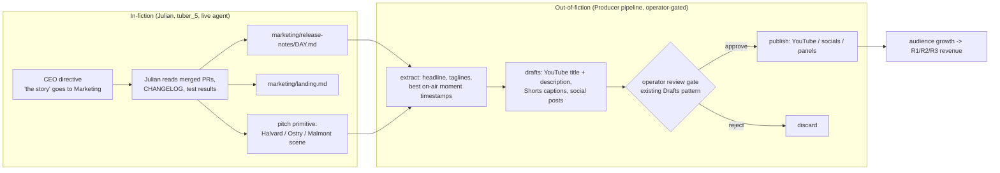

# ashiorid_office — Marketing & Revenue Plan (v0.1, exploration)

Date: 2026-09-27. Status: exploration only, nothing built. Written against
`origin/feat/ashiorid-office` (f8a7f34), which is not yet merged or checked out on `main`.

Source of truth for the office itself:
- `.claude/prompts/office_campaign_plan.md`
- `.claude/prompts/ashiorid_office_build_plan.md`
- `campaigns/ashiorid_office/lore/*.md`
- `campaigns/ashiorid_office/profiles/_cast_bible.md`

Marketing is seat 5 (`tuber_5`), **Julian Faire**. He reports to the CEO, owns the `marketing/`
lane of the Fraud-Stop repo, and runs on gemma4:26b according to the OB-07 benchmark.

---

## 1. The core question: what is actually sellable?

Running tubers produces three kinds of output. Their commercial value is very different.

| Output | What it is | Realistic value |
|---|---|---|
| **The show** | 24/7 serialized AI office drama, with real work happening on screen | **Highest.** This is the only output that reaches an audience directly |
| **The platform** | virtualTubers itself: an agent team plus stream stack plus campaign generator | **High, but slow.** This is the real engineering asset |
| **The artifact** | Fraud-Stop, the code the agents write | **Low as a product.** Useful as a *proof* and as marketing material |

### Why Fraud-Stop should not be sold as a product

Selling it would be the literal reading of "turn the code into revenue." It is the weakest path:
- **Liability.** It is a fraud-verdict engine written unsupervised by local LLMs. No bank or
  processor will buy it, and selling it as fraud protection invites liability if anyone relies
  on it.
- **It doesn't accumulate.** The weekly loop hard-resets the repo to `loop-seed` every Sunday
  (build plan OB-24, "Loop semantic"). The product never grows past one week of work. Only the
  archive branches survive.
- **Naming risk.** "Fraud-Stop" is a generic name and may collide with real products. Check it
  before any public use.

**Reframe:** the code is *evidence*. "Eight AI employees shipped N merged PRs, with tests, this
week, live" is the pitch. The money comes from the people who want to *watch* that happen, or
who want to *run it themselves*.

---

## 2. Revenue streams, ranked by effort-to-first-dollar

### R1. Audience monetization of the show (start here)

- **Twitch:** Affiliate first (subs, Bits, ads), then Partner.
  - The Affiliate bar is roughly 50 followers, 500 broadcast minutes and 7 unique broadcast days
    over 30 days, plus an average of 3 concurrent viewers. Verify the current numbers.
  - A 24/7 stream clears every threshold except viewers.
  - **Six channels split six small audiences.** Recommendation: make the **roundtable** the one
    monetized "main" channel. Treat the per-character channels as optional POV cams that link
    back to it. Each channel has to qualify for Affiliate on its own.
- **YouTube:** the long tail.
  - Daily "Episode" cut: one work day, 06:00–00:00 compressed to 15–25 min.
  - Shorts cut from the funniest beats, e.g. the Party Member looking up at "Malmont".
  - The weekly ring structure is already an episode structure: 28 segments give 7 episodes a
    season, and the Sunday reset is the season finale.
- **Chat as a paid lever.** The chat-voting ideas in `docs/weeklyLoopBrainstorm.md` map directly
  onto the CEO's GM mechanic ("New load at the dock"):
  - Channel Points (free) to vote on the next directive or client.
  - Bits (paid) to inject a complication node: Ostry flash sale, auditor visit, coffee machine
    breaks.
  - A sub perk: name a bank in the prospect pipeline, which Julian then pitches on stream.
  - This needs a Twitch EventSub listener. `twitch-presence` today only does anonymous IRC JOINs.

### R2. Sponsorship and product placement

The show is a live, continuous benchmark of agent tooling. That is a real marketing surface for:
- local-LLM runtimes and coding agents: Ollama, aider, OpenCode, model vendors
- hardware: the GB10 / DGX Spark box it runs on

Sponsor formats that fit the fiction:
- "The office runs on X": disclosed on an overlay and in the panel, never inside dialogue
- sponsored weeks: "this week the Engineer uses <tool>"
- a public leaderboard of merged PRs and tests passed per model

Disclosure is required. Use Twitch's branded-content toggle and FTC-style labels.

### R3. The platform as a product (the real code asset)

`virtualTubers` is GPL-3.0. Options:
- **GitHub Sponsors / Open Collective** on the public mirror. Linked from the stream panel. Cheap
  to set up.
- **Paid campaign packs.** The pack format (`campaigns/<name>/`) is a content product in its own
  right. Examples: "Office pack", "Heist pack", "D&D pack". Packs are data, not code, so they can
  be licensed separately.
- **Hosted "AI show in a box"** or setup consulting for streamers and companies who want their
  own agent-team stream. This is the biggest upside and the most work.
- **Dual licensing** (GPL plus commercial) is possible only if you hold copyright on every
  contribution. Audit the history for outside contributors first.

### R4. Data and benchmarks (later, and careful)

- The office agents' own sessions and PR history make a clean agent-evaluation dataset: synthetic
  company, no real PII.
- **Do not** include `sessionCorpus` material from your personal Claude/Hermes sessions. That is
  your private work, even after redaction (see the redaction gaps already noted in the build plan
  handoff).

### R5. Fraud-Stop itself (educational only)

- Publish the best archive week as an open-source teaching repo: "a fraud rules engine built live
  by AI agents, with its full design docs, requirements and tests."
- Its value is credibility for R1–R3 plus GitHub stars. It is not direct revenue.

---

## 3. How Julian fits in: two layers, kept separate

**Design tension, flagged.** The behaviour contract says every character believes they are real
(`behaviour_contract` in the WS-A profile schema). If Julian marketed to *real* viewers ("follow
the channel!"), he would break both the fiction and his own contract. So:

- **Julian stays in-fiction.** He sells Fraud-Stop to fictional banks. His work product is copy:
  release notes, taglines, pitch scenes. That copy is good *raw material* because it already
  translates each day's code into plain customer language.
- **A "Producer" pipeline sits outside the fiction.** It repurposes Julian's artifacts into real
  promo drafts. **Nothing auto-publishes.** Everything goes through the same approve/reject gate
  that Rerun Theater drafts already use (`control-panel` "Drafts awaiting review"). An autonomous
  agent posting publicly is a brand and safety risk that isn't worth taking.
- This fits your stated trust-boundary preference. The Producer never gets write access to the
  pack or host files. It reads the Fraud-Stop repo via the read-only Gitea token
  (`GITEA_TOKEN_OBSERVER`) and writes drafts to Postgres.

---

## 4. Training Julian (the in-fiction marketer)

"Training" here means prompt, knowledge and workflow. It does not mean fine-tuning. gemma4:26b
is enough if the inputs are structured.

### 4.1 Knowledge pack (read-only context, loaded into his brief)

1. `lore/product.md`, `lore/clients.md`, `lore/company.md` (already written)
2. **New** `lore/marketing_playbook.md`, an in-fiction document Julian "inherited". It holds:
   - **Positioning:** "The verdict before the money moves." Three pillars: speed (150 ms),
     explainability (every no has a reason), control (clients tune their own rules).
   - **Per-client message map:**

     | Client | Lead with |
     |---|---|
     | Corvane | latency and stability; never say "learned" |
     | Malmont | currency and country-mismatch tuning |
     | Pellbridge | readable reasons |
     | Ostry | fewer false declines |
     | Halvard | explainability plus the learned-scoring roadmap, with care |

   - **Feature → benefit translation table:**

     | Reason code | Customer image |
     |---|---|
     | `VELOCITY` | "stops the card-testing burst before the tenth charge" |
     | `AMOUNT_OUTLIER` | … |
     | `COUNTRY_MISMATCH` | … |

   - **Rules of honesty, in-fiction:** never announce a feature that hasn't merged with a green
     test run. This creates built-in drama with the Analyst, who "keeps getting footnotes", and
     with the Tech Lead.
   - **Release-note template:** headline / who it helps / what changed (plain language) / reason
     codes touched / "ask your account manager".
3. **Daily inputs, fetched by a handler rather than recalled from memory:**
   - PRs merged today
   - `CHANGELOG.md` diff
   - Tester pass/fail counts
   - the day's CEO directive

   Julian must only market what is in these inputs. That is the anti-hallucination rule; enforce
   it in code (see 4.3).

### 4.2 Daily workflow, mapped to the 18/6 clock

| Segment | Julian's beat | Artifact |
|---|---|---|
| s1 06:00 | Receives "the story" from the CEO directive. Asks Theo (Engineer) "what does it actually do?" | none (dialogue) |
| s2 12:00 | Lunch explainer with Theo. Drafts taglines out loud. Pitch rehearsal | `marketing/drafts/<day>.md` (PR) |
| s2 late | `pitch` primitive: a prospect call scene (Halvard, with the Party Member's notebook open) | pitch scene transcript |
| s3 18:00 | After Tester green plus Tech Lead merge, writes release notes from the actual merged diff | `marketing/release-notes/<day>.md` (PR) |
| s3 23:00 | Updates the pipeline whiteboard (optimistically, per his secret) | `marketing/pipeline.md` |

### 4.3 Guardrails, enforced in code rather than prompt wording

- **Lane check:** Julian's writes are restricted to `marketing/**`. This already exists as
  `LANES` in `app/office/roles.py`.
- **Grounding check:** before his release-notes PR opens, a validator confirms that every reason
  code and feature he names appears in today's merged diff or CHANGELOG. If not, it bounces back
  as a retake.
- **Copy lint:** a length cap, the required template headings, and no out-of-fiction tokens
  (Twitch, "stream", "viewers", "AI").

### 4.4 Evaluation: how we know he's "trained"

Run him for 3–5 simulated days on the archive and score each day:
- **Grounding:** the percentage of claims that trace to a merged PR. Target: 100%.
- **Voice:** judged against the cast bible (taglines, "picture a woman at a till…", never using a
  raw reason code without translating it).
- **Usefulness to the Producer:** how many drafts the operator approves unedited.

The third score is the real training signal. Feed rejected drafts back into the playbook as
examples.

---

## 5. Suggested order

| # | Step | Depends on |
|---|---|---|
| 1 | Merge / check out `feat/ashiorid-office`; finish the OB-10 character files, including Julian's profile | — |
| 2 | Write `lore/marketing_playbook.md` and add it to Julian's brief | 1 |
| 3 | Marketing handler (OB-21) with daily-input fetch plus the grounding validator | 1, OB-21 |
| 4 | Pick the monetized main channel, set up the panel, schedule the YouTube daily cut | none; can start now |
| 5 | Producer pipeline: extract → drafts → existing review gate | 3 |
| 6 | Twitch EventSub + Channel Points / Bits → complication-node primitive | 4, chat-voting design |
| 7 | Public GitHub mirror of `fraud-stop` archive weeks plus Sponsors | GitHub mirror token (expires **2026-10-03**) |
| 8 | Sponsor outreach once there is a public stats page | 4, 7 |

## 6. Open questions for the user

- Q1: Which revenue stream first: audience (R1), platform (R3), or both?
- Q2: Consolidate monetization onto one channel, or keep all six as equals?
- Q3: Should Fraud-Stop archive weeks be public on GitHub? That is required for R5 and is most of
  the credibility for R2 and R3.
- Q4: Is it acceptable for the Producer to be a Hermes / local-model job with operator approval,
  or should promo copy be fully manual?
- Q5: Do you want to consider a commercial license or dual license for virtualTubers? That needs
  a contributor audit first.
