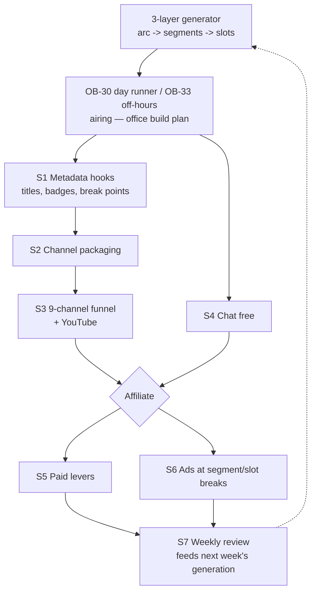

# Roundtable Stream — Monetization Playbook (v1.1, executable)

Date: 2026-09-27. Scope: the **roundtable** channel is the primary monetized channel. The 8
character channels are secondary channels that feed it.
Parent doc: `office_marketing_revenue_plan.md` (strategy R1, audience monetization).

Owner tags:
- **[YOU]** means a Twitch or YouTube dashboard or account action. The agent can't do it.
- **[BUILD]** means code in this repo.
- **[OPS]** means a run or verify step.

Every task has a **Done when** line that can be checked.

### v1.1 changes (user decisions D1–D4, 2026-09-27)

| Decision | What changed | What it broke / reworked |
|---|---|---|
| D1: the Party Member stays silent for several weeks | Removed "Party Member speaks" as a sub-goal reward | **Also removed `!watch`.** The cast bible says he has looked up only *twice* ever, at "Malmont" and at the learned-scoring branch. A chat command that makes him look up on demand would cheapen the one reaction he has. He gets **no** chat interactions at all |
| D2: category is Software & Game Development | S2.2 is fixed, no A/B test | Lead the packaging with "AI agents building real software". That is the category's audience |
| D3: 8 character streams + 1 roundtable = 9 channels | S3 reworked: every channel is kept and cross-promotes | Each channel qualifies for Affiliate separately. The roundtable is still where the growth effort goes. tuber_7 (Party Member) still has **no container** (build plan §7 known gap) |
| D4: no scheduler; the 3-layer arc and segments *are* the schedule | **The S1 "programming grid" scheduler is deleted.** Airing is owned by build plan OB-30 (day runner) and OB-33 (replay fallback + off-hours playlist) | The monetization hooks (titles, badges, ad breaks, metrics) now read from arc/segment/slot metadata instead of a grid. Episode rotation is gone, because the week is a continuous story and not a playlist |

---

## 0. Where we actually stand (verified 2026-09-27)

| Fact | Evidence | Monetization impact |
|---|---|---|
| The roundtable container is up and heartbeating, but **idle** | `docker logs worker-roundtable` | Dead air until OB-30 / OB-33 land. **Airing is the blocker for all revenue.** It is not a marketing task |
| The 3-layer generator plans the week as arc → 28 × 6 h segments → slots | `utilities/3LayersWeeklyGeneration`, `generation.yaml` `segment_hours: 6` | The segment and slot boundaries are natural points for titles, ads and "previously on" recaps |
| Office wall clock: Sunday-anchored, 4 × 6 h segments/day | `app/office/clock.py` (branch), `office_time()` / `segment_start()` | Anything time-based uses `office_time()`. Don't build a second clock |
| `TWITCH_CHANNEL_MAP` is empty; `twitch-presence` is an anonymous IRC JOIN only | `.env`, `services/twitch-presence/presence.py` | There is no chat reading, Bits, subs or redemptions yet |
| A recording tap exists (stream-copy, 5 GB budget) | `f2efb22`, `docs/stream_recorder.md` | YouTube clips can reuse the exact broadcast with no re-encode |
| The office campaign is on `feat/ashiorid-office`, not merged. OB-30 to OB-33 are todo | build plan status table | Monetization tasks that need the airing path wait for Wave 4 |

**[YOU]** Check:
- the real Affiliate thresholds per channel in Creator Dashboard → Achievements. Sources disagree:
  50 followers / 500 minutes / 7 days / 3 average viewers, against a claimed June 2026 cut to
  25 / 4 h / 4 days
- Twitch's current rules on AI-generated content and on labelling reruns

---

## Strategy map

See `roundtable_monetization_map.png` (re-render with `render_roundtable_monetization_map.py`).

Order: **airing (OB-30/33) → S1 → S2 → S3 → S4 get us to Affiliate. S5 and S6 turn it into money.
S7 runs every Sunday and feeds the next week's generator run.**

---

## S1. Metadata hooks on the generated schedule (replaces the old scheduler)

Goal: everything monetization needs is derived from what the generator already produces. There
is no second source of truth about what airs when.

### S1.1 [BUILD] "Now airing" record

- Whatever OB-30 / OB-33 sends to air publishes a small `now_airing` event with these fields:
  - `arc_id`, `segment_id`, `slot_id`
  - `title` (segment/slot title from the generator)
  - `kind` (`spine` / `ambient` / `replay` / `live`)
  - `office_time` (week/day/segment/phase)
  - `first_aired_at`
- The event goes on Kafka and into Redis. This is the **single hook** that S2.4, S2.7, S6 and S7
  read. Monetization code never reaches into the generator.
- **Coordinate with OB-30/OB-33** so that the event is part of their "Done when", not a
  retrofit.
- **Done when:** during a test airing, `now_airing` changes at each slot boundary. Check it by
  reading Redis/Kafka, then compare against the aired transcript.

### S1.2 [BUILD] Recap / break slots from the generator

- Ask Layer 2 (`segment_schema.py`) to reserve a short `kind: break` slot. Candidate spots:
  - the start of each 6 h segment
  - optionally one mid-segment
- The break slot renders as an intermission card:
  - "Previously at Ashiorid…", a 2-line recap from the segment summary
  - "Coming up: <next slot title>"
  - office music
- This gives ads (S6) and the call to action a place that **the story itself** allows, rather
  than an external timer cutting into a scene.
- **Flag:** this changes the generator's slot contract. It needs an entry in the generator design
  decisions doc and a `pack_gate` / validator update so that break slots aren't counted as missing
  dialogue.
- **Done when:** a generated segment contains break slots, the validator passes, and a screen
  capture at a break shows the recap card.

### S1.3 [OPS] Airtime coverage

- The 168 h week relies on ambient batches going through stage → gate → **promote**, which is an
  explicit user step.
- Monetization needs **no dead air**, so before each week check that the promoted content covers
  every s0 to s3 segment, and that OB-33's fallback playlist is non-empty.
- **Done when:** a coverage report for the week shows 0 uncovered hours.

---

## S2. Channel packaging (roundtable)

Mostly **[YOU]**.

| # | Task | Done when |
|---|---|---|
| S2.1 | **Brand the roundtable as the show:** "Ashiorid — the office that never closes. 8 AI employees ship real code, live." Profile image = the roundtable grid, banner = office art | Channel page updated |
| S2.2 | **Category: Software and Game Development** (D2). Tags: `AI`, `AIAgents`, `LLM`, `Python`, `24/7`. Lead the pitch with the real Fraud-Stop repo and real tests. That is what this category's audience cares about | Category + tags set |
| S2.3 | **AI disclosure everywhere:** title tag "AI-generated", a panel ("Every character is an AI agent. Scenes are generated; live work is real code on a real repo."), and an overlay line | Visible in the title, a panel and the overlay |
| S2.4 | **[BUILD] REPLAY / LIVE badge** driven by `now_airing.kind`: `LIVE` for live agent work, `REPLAY · first aired <date>` for replays. No replay ever claims to be live | The badge is correct for both kinds in a test airing |
| S2.5 | **Panels:** About / Cast (8 cards, each linking to that character's channel) / "How it works" / Repo link (once public) / Support | Panels live |
| S2.6 | **Twitch Schedule** from the office clock: publish the 4 daily phases (00:00 After hours, 06:00 Standup, 12:00 Build, 18:00 Ship). The **06:00 standup** and the **18:00 ship / demo** are the "tune-in" moments | Schedule visible |
| S2.7 | **[BUILD] Title rotation** from `now_airing.title`, e.g. "Day 3 · Ship — The Ostry Flash Sale · AI-generated". Uses a Helix `channels` PATCH, which needs `channel:manage:broadcast`. **[YOU]** put the token in `.env` as `TWITCH_BROADCASTER_TOKEN_ROUNDTABLE`. Update the title per segment rather than per slot, to avoid churn and rate limits | The title changes within 30 s of a segment boundary |

---

## S3. The 9-channel funnel (D3)

8 character channels (tuber_0 to tuber_7) + 1 roundtable. The roundtable is where growth effort
goes. Character channels are "POV cams": fans of one character can follow them, and they always
point back to the roundtable.

| # | Task | Owner | Done when |
|---|---|---|---|
| S3.1 | **POV branding:** title template "POV: <Name> (<Title>) · Ashiorid · full show → <roundtable>". The Party Member's channel is "The Corner Desk" and stays silent. It is an ambient watcher cam, which is a hook in itself | YOU (+ BUILD for titles, same S2.7 code per channel) | All 8 retitled |
| S3.2 | **Per-channel title rotation:** the same S2.7 code, one token per channel. Store each as `TWITCH_BROADCASTER_TOKEN_<SEAT>` in `.env` | BUILD | 9 titles update at segment boundaries |
| S3.3 | **Raids and hand-offs:** when a character is in the roundtable scene (from the slot's participants), their POV title shows "on the roundtable now". At the 18:00 Ship phase, the character channels raid the roundtable for the demo. Needs `channel:manage:raids` per channel | BUILD + YOU | A raid lands on the roundtable at 18:00 |
| S3.4 | **tuber_7 container:** the Party Member channel needs a worker. This is already a known gap in the office build plan, OB-22 compose | BUILD (office plan) | The channel is live |
| S3.5 | **Capacity check:** 9 simultaneous encodes, plus live agents, on the GB10. Measure dropped frames and encoder load once all 9 are up. If it's tight, character channels drop to a lower bitrate or resolution. **The roundtable keeps full quality** | OPS | Twitch Inspector shows a stable ingest on all 9 for 24 h |
| S3.6 | **[BUILD] YouTube daily episode:** after the 18:00–00:00 Ship segment, the recording tap's roundtable MP4 becomes "Day N" with a title from the arc. It goes to the existing review queue. **No auto-publish** | BUILD | One approved upload linking to Twitch |
| S3.7 | **[BUILD] Clip picker:** the local LLM ranks moments from the slot transcripts. It outputs timestamps plus captions as draft Shorts in the review queue | BUILD | Five candidates a day; at least 1 approved |
| S3.8 | **Community seeding:** r/LocalLLaMA, AI-agent Discords and forums. Lead with *how it's built*. Follow each community's self-promotion rules | YOU | 3 posts, linked in the metrics sheet |

Recording budget: the 5 GB cap covers one roundtable Ship segment a day. Don't record all 9
channels.

---

## S4. Chat interaction (free, before Affiliate)

### S4.1 [BUILD] Chat reader

- Replace or extend `twitch-presence` with authenticated EventSub `channel.chat.message` on all 9
  channels. **[YOU]** set up the bot account and app.
- Publish `chat_command {user_hash, command, args, channel}` to Kafka. Store the hash, never the
  user name.
- Chat text is untrusted. Map every command to a **fixed enum**, and never put raw chat into a
  prompt. Rate-limit per user.

### S4.2 [BUILD] Votes at generated forks

- Where the arc has `branches:` (spine forks), open a 60 s `!a` / `!b` vote on the roundtable with
  an overlay tally.
- Ties go to the `weight`. No votes means the default, so the show never stalls.
- **Flag:** the ring and fork features are partly unbuilt in the generator (build plan: "forks/
  events, tethers and the JIT picker are unbuilt"). Votes can only affect forks the generator
  actually produced. Until the JIT picker exists, both branches must be pre-generated.

### S4.3 [BUILD] Office commands (cosmetic, enum-only, roundtable)

- `!coffee`: Nora brings a coffee to the current speaker at the next slot gap (a canned beat).
- `!client <corvane|malmont|pellbridge|ostry|halvard>`: a vote on which client the next day's
  06:00 directive involves.
  - The result is fed to **the next generator/OB-30 directive input**, not injected mid-scene.
  - This is the cleanest link from chat to the generated schedule.
- **No Party Member commands** (see D1 / v1.1 changes).

### S4.4 [BUILD] POV-channel commands

- Each character channel accepts `!ask <topic-enum>` (e.g. Julian: `pitch`, `halvard`,
  `tagline`).
- The character answers in their next idle beat on their own channel. Keep it cosmetic: it must
  not change the roundtable's story.
- The Party Member channel has **no** commands.

**Done when (S4):** in a preview-RTMP test with a test channel:
- `!a` changes the aired branch, checked against the transcript
- `!client halvard` shows up in the next directive

---

## S5. Paid levers (after Affiliate, per channel)

Each paid lever upgrades a free S4 mechanic.

| Lever | Mechanic | Start pricing | Build |
|---|---|---|---|
| **Channel Points** | `!coffee` without cooldown. "Tell Julian a tagline idea" from a moderated list | defaults | EventSub redemption events |
| **Bits: complication** | Cheer ≥ 500 queues a **pre-generated** complication slot at the next segment break: Ostry flash sale, auditor at reception, coffee machine dies, cream-paper letter arrives. The CEO absorbs it as "New load at the dock" | 500 / 1000 / 2500 by severity | EventSub `channel.cheer`, then pick from an ambient pool tagged `complication: true` |
| **Subs: the Halvard pipeline** | An opt-in subscriber name, moderated in the control panel, becomes a fictional prospect bank that Julian pitches that week. It feeds the next generator run as client input | Tier 1 | name store + review queue + generator input |
| **Sub goal** | "At N subs: after-hours special": a bonus s0 ambient episode, e.g. Nora's midwinter hamper night or Friday-demo bloopers. **No Party Member reward** (D1) | — | a pre-generated ambient pool with a `reward: true` tag |
| **Sub emotes** | Nora's mug, "Fair?" (CEO), "It's green." (Tester), Julian's plant, the notebook (an image only, never opened) | — | [YOU] art |

Guardrails:
- Paid actions only pick **pre-generated** content.
- Any name goes through moderation.
- One complication per segment, with a queue when more arrive.
- Complications land at S1.2 break slots, never mid-scene.

---

## S6. Ads

- [YOU] Once Affiliate is on, set ad frequency in Creator Dashboard → Monetization.
- **[BUILD]** When `now_airing.kind == break` (S1.2), call Helix `channels/commercial` (scope
  `channel:edit:commercial`). Ads then only ever run at generator-planned breaks.
- Character channels: ads at their own segment boundaries (same hook).
- **Done when:** over one broadcast day, every ad timestamp in the Twitch ads log falls inside a
  `break` slot.

---

## S7. Measure and iterate (Sunday, at the loop reset)

### S7.1 [BUILD] Metrics collector

- Sample viewers every 5 min per channel into the app DB `stream_metrics(ts, channel, viewers,
  followers, arc_id, segment_id, slot_id, kind)`. `arc_id`, `segment_id`, `slot_id` and `kind`
  come from `now_airing`.
- A Grafana panel sits next to Loki.

### S7.2 [OPS] Sunday review, feeding the next generator run

Answer five questions:
1. Average viewers per channel against the Affiliate bar.
2. **Which phases and slot kinds hold viewers?** For example, does the Ship phase beat Build, and
   do spine slots beat ambient ones? Record the answer as generator guidance for next week: more
   of what held, and pacing/tone changes in the arc prompt.
3. Chat commands per hour, per channel.
4. Follower sources: YouTube, community posts, raids.
5. Revenue by lever, once S5 exists.

Log the decisions at the bottom of this file. This is the loop in the map: the metrics go back
into the arc planning.

### KPI targets (first 60 days)

| Metric | Day 30 | Day 60 |
|---|---|---|
| Roundtable airtime with no dead air | ≥ 18 h/day (the work day) | 24 h |
| Roundtable avg concurrent viewers | 3 (Affiliate) | 8 |
| Roundtable followers | 50 | 200 |
| Character channels at Affiliate | 0 (expected) | 2+ (likely CEO / Engineer / Marketing) |
| YouTube uploads | 10 | 40 + Shorts |
| Revenue | $0 (qualifying) | first payout |

---

## Execution order

| Phase | Contents | Gated by |
|---|---|---|
| **Now (no code)** | S2.1–S2.3, S2.5, S2.6 packaging; S3.1 POV branding; [YOU] checklist | nothing |
| **With office Wave 4** | S1.1 `now_airing` inside OB-30/OB-33; S1.3 coverage check; S2.4 badge; S2.7/S3.2 titles | OB-30, OB-33 |
| **Generator change** | S1.2 break/recap slots + validator update | the generator design decision |
| **After airing works** | S4 chat; S7.1 metrics; S3.6/S3.7 YouTube + clips; S3.3 raids; S3.5 capacity check | S1.1 |
| **On Affiliate** | S5 levers, then S6 ads at breaks | Affiliate + S1.2 |

## [YOU] Checklist

- [ ] Record the real Affiliate thresholds (Creator Dashboard → Achievements)
- [ ] Review Twitch's AI-content and rerun-labelling rules; note constraints here
- [ ] Roundtable: rename/brand, category **Software and Game Development**, tags, panels, schedule
- [ ] 8 character channels: POV branding; Party Member channel is "The Corner Desk"
- [ ] Twitch app + bot account. Tokens go in `.env`; the agent never reads them:
  - per channel: `channel:manage:broadcast`, `channel:edit:commercial`, `channel:manage:raids`,
    `bits:read`, `channel:read:subscriptions`, `channel:read:redemptions`,
    `channel:manage:redemptions`, `moderator:read:followers`
  - bot: `user:read:chat`, `user:write:chat`
- [ ] YouTube channel
- [ ] Renew the Gitea→GitHub mirror token **before 2026-10-03**

## Open decisions

- D5: break slots (S1.2): should Layer 2 generate them (it changes the slot contract), or should
  OB-30 insert them at segment starts without touching the generator?
- D6: when does the Party Member's silence end? Recorded only so that S5 can add a reward later.
  Currently "several weeks", no reward planned.

## Decisions log

- 2026-09-27: monetize the roundtable channel first.
- 2026-09-27:
  - D1: the Party Member stays silent for several weeks. No speech reward, and no chat
    interaction with him at all.
  - D2: category is Software and Game Development.
  - D3: 8 character streams + 1 roundtable.
  - D4: no separate scheduler. The 3-layer arc and segments are the schedule, and airing is owned
    by OB-30/OB-33.
