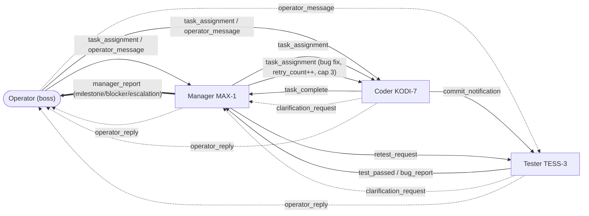

# Implementation Plan — Worker Interaction over Kafka

> Status: **planned, not yet implemented**. Branch: `claude/virtualtubers-repo-access-8wx0n2`.
> This plan wires up the missing inter-agent message types so Manager/Coder/Tester
> hand work off to each other and report back to the operator (the boss), per
> `docs/VTuber_AI_Dev_Team_Concept.md` §3.4.

---

## 1. Context — the gap

The message-type table in `docs/VTuber_AI_Dev_Team_Concept.md` §3.4 defines eight
types (`task_assignment`, `task_complete`, `clarification_request`,
`commit_notification`, `bug_report`, `test_passed`, `retest_request`,
`status_update`), but `app/agent.py` only handles **one**: `task_assignment`
(LLM narration → reply `task_complete`/`clarification_request` to the sender).

Consequences today:
- No Coder→Tester handoff (`commit_notification` is never sent).
- No Tester→Manager reporting (`bug_report`/`test_passed` never fire).
- No Manager re-delegation on a bug, no `retest_request`.
- No explicit feedback surface for the operator beyond passively watching the
  Kafka feed pane — a worker can address `to: "operator"` but nothing does.
- `message-api`'s **default** message type `operator_message` is handled by no one.

So the system is "operator → one worker → reply", not a collaborating team.

## 2. Scope boundaries (explicitly OUT)

- **No real test execution.** The tester's pass/fail decision is a stub heuristic
  (see §4.3 and Open Decision A). Real pytest/linter runs against `/data/repo`
  are separate roadmap work (concept doc Phase 1).
- **No goal decomposition.** Manager auto-splitting a high-level operator goal
  into multiple tickets is future work — this plan makes a *single* ticket flow
  through the whole team correctly.
- **No persistent ticket/world-state store.** `world_state:` config is confirmed
  dead (nothing in `app/` or `services/` reads `/data/world-state`). All needed
  state (e.g. `retry_count`) travels statelessly in message payloads.

## 3. Communication topology (target state)

All traffic stays on the single shared topic `vtuber.messages`; arrows are
logical `from`→`to` routing, not separate channels.



Ticket lifecycle: operator (or manager) assigns → coder narrates + replies
`task_complete` to sender **and** `commit_notification` to tester → tester
"runs tests" → `test_passed` or `bug_report` to manager → manager celebrates
(`manager_report` milestone to operator) or re-delegates a fix
(`task_assignment` to coder, `retry_count + 1`; at `retry_count >= 3` escalate
to operator instead — bounds the bug↔fix loop).

## 4. Changes — `app/agent.py`

Reuse the existing style exactly: plain functions, signature
`(worker_id, agent_config, llm_client, producer, msg, state_path=None)`,
`producer.send(build_message(...))`, `write_state(...)` at the same lifecycle
points `handle_task_assignment` already uses. Handlers branch on
`agent_config.get("role")` (already in config, currently unused) — no new
config-driven collaboration graph; there are only 3 roles and more is Phase 5.

### 4.1 New constants + heuristic seam

```python
import random  # new import

TEST_PASS_PROBABILITY = 0.7
BUG_SEVERITIES = ["low", "medium", "high", "critical"]
BUG_SEVERITY_WEIGHTS = [10, 40, 35, 15]
MAX_BUG_RETRIES = 3

def _decide_test_outcome():  # -> (passed: bool, severity: str | None)
    ...
```

Factored out (not inlined) so tests can monkeypatch it — same seam pattern
already used for `select_pane`/`send_keys` in `tests/test_agent.py`.

### 4.2 Extend `handle_task_assignment` (coder → also notifies tester)

After the existing `task_complete` send, when `role == "coder"`, also send
`commit_notification` to `"tester"` with
`{"task", "commit_message": f"Implement: {task}", "narration"}`. Failure branch
unchanged. Hardcoded worker-id strings match existing repo convention
(configs/docker-compose already hardcode `coder`/`manager`/`tester`).

### 4.3 Tester: `handle_commit_notification` / `handle_retest_request`

Both role-gate (`role == "tester"`, else log + no-op) and delegate to one shared
helper `_run_tests_and_report(...)`:
1. avatar `focused`, action `testing: <task>`
2. LLM narrates running the suite (in character — TESS-3's persona already
   anticipates exactly this)
3. `_decide_test_outcome()`:
   - **pass** → avatar `happy`, send `test_passed` to `"manager"`
   - **fail** → avatar `speaking` (smug, not distressed — persona fit), send
     `bug_report` to `"manager"` with `severity` + fabricated `repro`
4. Tester's own LLM failure → avatar `frustrated`, send `clarification_request`
   to `"manager"` (same contract shape the coder already uses, retargeted — so
   one manager-side handler covers both origins).

### 4.4 Manager: four new handlers (all role-gated to `manager`)

- **`handle_bug_report`** — narrate reprioritization; re-delegate
  `task_assignment` to `"coder"` with the bug folded into `payload["task"]`
  (`Fix bug (<severity>): <task>. Repro: <repro>`) and
  `retry_count = incoming + 1`. At `retry_count >= MAX_BUG_RETRIES`: avatar
  `frustrated`, **escalate** to operator instead of resending (breaks the loop).
  If the manager's own LLM fails, still escalate with a fallback narration
  string — a blocker must not vanish because two LLM calls failed back to back.
- **`handle_test_passed`** — narrate celebration (persona: "celebrates team
  wins"), avatar `happy`, send a `"milestone"` report to operator.
- **`handle_task_complete`** — narrate acknowledgment, avatar `speaking`,
  **deliberately no bus send** (the coder's own `commit_notification` drives
  the tester; don't duplicate). Flag this in a docstring so nobody "fixes" it.
- **`handle_clarification_request`** — narrate assessment, avatar `frustrated`,
  **always** escalate a `"blocker"` report to operator (fallback narration on
  LLM failure). Deliberately does NOT auto-resend `task_assignment` — avoids a
  retry storm against a broken LLM endpoint; matches concept doc §11
  "Human override".

### 4.5 Operator feedback channel

- **`_send_manager_report(worker_id, producer, report_type, task, narration, extra=None)`**
  — always manager → `"operator"`, new type **`manager_report`**, payload carries
  `report_type: "milestone" | "blocker" | "escalation"` as a discriminator
  (one type, not three — downstream branches on the payload field).
  Deliberately NOT reusing `status_update`: that type is in the feed's default
  `hide_types` (heartbeat flood filter), which would hide the very feedback we
  want visible.
- **`handle_operator_message`** (any role, no gate) — handles `message-api`'s
  existing default type. Lightweight: LLM reply only, NO `demo_editor_note`/
  `demo_filetree_ls` side effects. Replies `to: "operator"` with new type
  **`operator_reply`** (`{"narration"}`, or `{"error"}` on LLM failure).

### 4.6 Dispatch

Replace the single `if msg["type"] == "task_assignment"` in `main()`'s loop with:

```python
MESSAGE_HANDLERS = {
    "task_assignment": handle_task_assignment,
    "commit_notification": handle_commit_notification,
    "retest_request": handle_retest_request,
    "bug_report": handle_bug_report,
    "test_passed": handle_test_passed,
    "task_complete": handle_task_complete,
    "clarification_request": handle_clarification_request,
    "operator_message": handle_operator_message,
}
# in main():
handler = MESSAGE_HANDLERS.get(msg["type"])
if handler:
    handler(worker_id, agent_config, llm_client, producer, msg, state_path)
```

Defined after all handlers (bottom of file, above `main()`).

### 4.7 Avatar state summary

| Handler | Before | Success | Failure |
|---|---|---|---|
| task_assignment (existing) | thinking | speaking | frustrated |
| commit_notification / retest_request | focused | happy (pass) / speaking (bug) | frustrated |
| bug_report | thinking | speaking (re-delegate) / frustrated (escalate) | frustrated |
| test_passed | thinking | happy | frustrated |
| task_complete | thinking | speaking | frustrated |
| clarification_request | thinking | frustrated (always — escalation) | (fallback, same) |
| operator_message | thinking | speaking | frustrated |

Only existing expression keys used — every worker YAML already defines all of them.

## 5. Changes — feed rendering

`config/panels/kafka_feed.yaml` **and** the mirrored `DEFAULT_FEED_CONFIG` in
`app/tail_bus.py` (the two must stay in lockstep per their own comments):

- `content.highlight` add: `bug_report: red`, `test_passed: green`,
  `manager_report: cyan`, `operator_reply: blue`.
  (`commit_notification`/`retest_request`/`operator_message` stay uncolored —
  routine handoffs, not milestones/alerts.)
- `content.colors` add sender: `operator: blue`.

## 6. Tests — `tests/test_agent.py`

Follow the existing `FakeProducer` / `FakeLLM` / `monkeypatch` / `tmp_path`
pattern. One per handler plus the seams and dispatch table:

1. coder task_assignment also emits `commit_notification` to tester (2 sends)
2. role-mismatch no-ops (commit_notification as coder, bug_report as tester,
   etc.): no LLM call, no send
3. tester pass path (`_decide_test_outcome` → `(True, None)`): `test_passed`
   to manager, avatar `happy`
4. tester bug path (`(False, "high")`): `bug_report` with severity + repro
5. `retest_request` behaves identically to `commit_notification`
6. bug_report re-delegates with `retry_count` incremented
7. bug_report escalates (`manager_report`, no `task_assignment`) at cap
8. test_passed → `manager_report` with `report_type == "milestone"`
9. task_complete → narration only, `producer.sent == []`
10. clarification_request → exactly one `manager_report` (`"blocker"`)
11. clarification_request still escalates when the manager's LLM fails
12. operator_message → `operator_reply` to operator; demo tmux helpers NOT called
13. `MESSAGE_HANDLERS` keys == the 8 documented types

## 7. Docs

- `docs/agent.md` — Overview gains the collaboration-graph paragraph; add all
  new signatures; Parameters notes the `role` gate; Dependencies adds `random`;
  Error Handling documents role-mismatch no-ops + escalate-despite-LLM-failure;
  Usage Examples adds a `bug_report`/`operator_message` curl; Changelog
  `v1.5.0 (2026-07-02)`.
- `README.md` — new "Recent Changes" entry (newest-first, existing style):
  agents now hand off work to each other; `manager_report`/`operator_reply`
  types; link to docs/agent.md.
- `docs/message_bus_feed.md` + `docs/panels.md` — update the `highlight`
  default-map examples (and `colors` with `operator`) to match; no logic
  changes needed there (rendering is type-agnostic).

## 8. Risks / edge cases

1. **Role-mismatch no-ops are load-bearing** — routing is by hardcoded worker-id
   string; a `WORKER_ID`/`role` mismatch must log + no-op, never crash.
2. **Bug loop is capped, not eliminated** — each cycle burns ~3 LLM calls
   (coder + tester + manager). `MAX_BUG_RETRIES = 3` bounds cost/pacing.
3. **Broadcast operator_message fans out** — `to: "broadcast"` reaches all three
   workers → three independent `operator_reply`s. Existing consumer behavior,
   not a bug; no de-duplication planned.
4. **Unseeded `random`** in `_decide_test_outcome` — fine live (variety is the
   point); tests must monkeypatch, never assert statistically.
5. **`manager_report.report_type` is a payload convention** — one message type,
   not three; future consumers branch on the payload field.

## 9. Open decisions (defaults chosen; flag before/at implementation)

- **A. Test-outcome stub**: default = weighted random (`TEST_PASS_PROBABILITY = 0.7`).
  Alternatives considered: real pytest execution (bigger scope, deferred) or
  LLM-judged outcome (extra LLM call per commit). Constants are module-level
  specifically so tuning/replacing is one edit.
- **B. Retry cap**: default `MAX_BUG_RETRIES = 3`. Tune for stream pacing/LLM cost.

## 10. Verification

1. `pytest tests/ -v` — new + existing tests green (message_bus, message_api,
   tail_bus_format, build_layout, agent).
2. End-to-end (needs a reachable Kafka broker; Postgres optional for logging):
   ```bash
   curl -X POST http://localhost:8090/messages \
     -H "Content-Type: application/json" \
     -d '{"to": "coder", "type": "task_assignment", "payload": {"task": "add a healthcheck endpoint"}}'
   ```
   Watch the Kafka feed pane / `docker logs`: coder → `task_complete` +
   `commit_notification` → tester → `test_passed` **or** `bug_report` →
   manager → `manager_report` (new cyan highlight) or re-delegated
   `task_assignment`; bug path terminates within 3 retries with an escalation.
3. Direct channel:
   ```bash
   curl -X POST http://localhost:8090/messages \
     -H "Content-Type: application/json" \
     -d '{"to": "tester", "type": "operator_message", "payload": {"message": "status?"}}'
   ```
   Expect one `operator_reply` (blue) addressed to `operator` on the feed.

## Files touched

| File | Change |
|---|---|
| `app/agent.py` | 7 new handlers, 3 helpers, constants, dispatch table |
| `app/tail_bus.py` | `DEFAULT_FEED_CONFIG` highlight/colors additions |
| `config/panels/kafka_feed.yaml` | same additions (lockstep) |
| `tests/test_agent.py` | ~13 new tests |
| `docs/agent.md` | overview/signatures/changelog v1.5.0 |
| `docs/message_bus_feed.md`, `docs/panels.md` | default-map examples |
| `README.md` | Recent Changes entry |
