# virtualTubers — High-Level Component & Data Flow

Two largely independent systems share this repo, joined by a handful of
**upload paths** — all human-run except one opt-in generator auto-submit that
can only create review **drafts**, and all of them going through
`message-api` (there is no direct DB write from outside it).
Render the Mermaid block with any Mermaid-capable viewer (VS Code preview,
GitHub, Obsidian, mermaid.live). A rendered PNG lives alongside this file
(`architecture_flow_diagram.png`, via `scripts/render_architecture_graph.py`).

```mermaid
flowchart TB
    subgraph LIVE["LIVE STREAM SYSTEM — docker-compose.yml, always-on"]
        direction TB

        Operator["Operator (you)<br/>curl / browser"]
        CP["control-panel<br/>:8091 — HTTP GUI<br/>+ /replays upload UI · draft approve/reject<br/>+ worker health column"]
        MAPI["message-api<br/>:8090 — FastAPI<br/>sole Kafka publisher ·<br/>sole INSERT into replay_episodes<br/>(draft | approved) · /workers/health"]
        Kafka[("Kafka<br/>vtuber.messages (single topic)")]
        Redis[("Redis<br/>worker on/off flags + log-filter excludes<br/>+ liveness keys worker:{id}:alive<br/>(reads fail-open) — NOT world-state")]
        MLog["message-logger<br/>sole durable bus archive"]
        AppPG[("Postgres (app)<br/>virtualtubers @ 192.168.1.120:5432<br/>messages · replay_episodes · voiced_narration<br/>container_logs · coding_backend_runs")]
        LogShip["log-shipper<br/>(reads docker.sock)"]
        TwitchPres["twitch-presence<br/>(watches Twitch)"]

        subgraph Workers["6 character workers + GM + roundtable — each container = agent (Kafka prod+cons) + replay_pane + streaming stack + local kill file"]
            Coder["worker-coder<br/>(+ -native/-opencode/-aider)"]
            Manager["worker-manager<br/>(+ opt-in task backlog)"]
            Tester["worker-tester"]
            GM["worker-gm (tuber_0)<br/>GM's own character channel"]
            RTable["worker-roundtable<br/>roundtable director: LLM+TTS for all speakers<br/>hosts all 8 tiles LOCALLY"]
        end

        Stream["streaming per worker: Xvfb + xterm + tmux + PulseAudio (vout)<br/>+ ffmpeg → RTMP — 1 Twitch channel per worker"]
    end

    subgraph GEN["OFFLINE CONTENT GENERATOR — separate stack, on-demand"]
        direction TB
        CampMgr["campaign-manager<br/>:8082 — job GUI"]
        GenAPI["3layer-generator<br/>:8001 — Arc → Segment → Dialogue<br/>LLM planner layers"]
        GenPG[("Postgres (generator)<br/>generation @ 127.0.0.1:5455<br/>job state only — NOT the app DB")]
        Packs["campaigns/*.yaml<br/>(pack input)"]
        Output["utilities/3LayersWeeklyGeneration/output<br/>(generated dialogue library)"]
    end

    Bridge["Upload paths → POST /replays:<br/>human-run (stored approved): build_campaign_episode.py · build_generated_episode.py<br/>build_roundtable_test_episode.py · scripts/build_replay_library.py<br/>+ control-panel /replays/upload UI + generator POST /publish/run/upload<br/>automated, opt-in (AUTO_SUBMIT_DRAFTS): generator publish job → status=draft<br/>(never airs until approved in control-panel)"]

    Operator -->|"instructions"| CP
    Operator -->|"curl POST /messages"| MAPI
    CP -->|"HTTP, incl. /replays upload"| MAPI
    MAPI -->|"publish (sole Kafka producer)"| Kafka
    Kafka -->|"consume/produce on every worker;<br/>duet relay: replay_invite·ready·cue·end"| Workers
    Workers <-->|"narration cache r/w — dual-write into voiced_narration;<br/>episode READ — all workers (Rerun Theater)"| AppPG
    MAPI -->|"sole INSERT into replay_episodes<br/>(episode_store.py:84) · approve UPDATE"| AppPG
    MLog -->|"writes: messages · voiced_narration (text)<br/>· coding_backend_runs"| AppPG
    MAPI -->|"set on/off flags + log-filter excludes;<br/>read liveness for /workers/health"| Redis
    Workers <-->|"on/off flag worker:{id}:enabled (fails open on read;<br/>local kill file wins) · write worker:{id}:alive every tick"| Redis
    MLog -.->|"reads log-filter excludes before persisting"| Redis
    Workers -->|"tmux session capture"| Stream
    LogShip -->|"writes container_logs (+ retention)"| AppPG
    TwitchPres -->|"viewer_joined → bus broadcast;<br/>workers may auto-pick a random approved episode (agent_handlers/viewer.py:32-39)"| MAPI
    RTable -.->|"TILE_RELAY_DIR relay files: cues its OWN 8 tile seats<br/>(in the roundtable container only — not the other workers)"| RTable

    CampMgr -->|"submit/watch job, HTTP"| GenAPI
    GenAPI -->|"reads"| Packs
    GenAPI -->|"job state, artifacts"| GenPG
    GenAPI -->|"writes"| Output

    Output -.->|"run artifacts"| Bridge
    GenAPI -.->|"opt-in auto-submit<br/>(draft_submitter.py)"| Bridge
    Bridge -.->|"urllib/curl/HTTP → POST /replays"| MAPI

    style GEN fill:#2a2a3d,stroke:#888
    style LIVE fill:#1f2a1f,stroke:#888
    style Bridge fill:#4a1f1f,stroke:#f66,stroke-width:2px
```

## Reading it

**Live stream system** (what's actually running 24/7 via `docker compose up`):
- `message-api` is the single door into the bus and into the replay-library
  writes: the operator, the browser control panel (incl. its `/replays/upload`
  UI), and `twitch-presence` all go through it. It is the **sole Kafka
  publisher** and the **sole writer** of `replay_episodes` (one `INSERT` in the
  whole repo, `app/episode_store.py:84`, reached via `POST /replays`; the
  only other write is the draft → approved `UPDATE` behind
  `POST /replays/{name}/approve`, `app/episode_store.py:128-140`).
- Everything downstream is Kafka fan-out on ONE topic (`vtuber.messages`):
  every worker container's `agent.py` is both producer and consumer
  (`app/agent.py:176-177`), dispatching to `app/agent_handlers/`.
  Cross-worker duet shows ride the same bus via the
  `replay_invite`/`replay_ready`/`replay_cue`/`replay_end` relay handlers
  (`app/agent_handlers/replay_relay.py:178-292`).
- `message-logger` is the sole durable bus archive → **app** Postgres
  (`messages`, `voiced_narration` text rows, `coding_backend_runs`). Note the
  dual-write on `voiced_narration`: workers upsert the full row (text + WAV)
  via `app/narration_store.py` without touching the bus; both writers converge
  on `ON CONFLICT (message_id, scene_index)`.
- **Episode reads are a universal worker capability** — `replay_pane` and
  the agent handlers in every container read `replay_episodes` (viewer-join
  can trigger a random rerun, `app/agent_handlers/viewer.py:32-39`). Every
  worker read is **approved-only** (`app/episode_store.py:108-115`), so a
  draft can never air. Only the *write* path is centralized.
- Redis is small shared state with exactly THREE jobs: the per-worker on/off
  flag (`worker_control.py`, fail-open on read — but a local kill file in the
  worker container overrides it without consulting Redis), per-message-type
  log excludes (`log_filter_control.py`, checked by message-logger), and
  per-worker liveness keys `worker:{id}:alive` (JSON `{ts, local_override,
  ttl_s}`, written by every agent tick with a TTL, read by
  `GET /workers/health`). **World-state is NOT in Redis** — it's a local
  file per worker (`world_state.backend: file`, `/data/world-state`, e.g.
  `config/workers/tuber_0.yaml:217-220`).
- Output is each worker's full streaming stack — Xvfb + xterm + tmux layout +
  PulseAudio `vout` sink + ffmpeg — captured to its own Twitch channel (or
  local `rtmp-preview` for testing). This pipeline has no dependency on Kafka;
  its control surfaces are the Redis on/off flag and the local kill file
  (`WORKER_KILL_FILE`, created by `scripts/emergency_stop.sh` or SIGUSR1).
- The roundtable worker (`worker-roundtable`) is special, but in a LOCAL
  sense: it runs the LLM narration + TTS for *every* speaker and hosts **all
  8 roundtable seats in its own container**, cueing them with
  `TILE_RELAY_DIR` relay files (default `/tmp/tiles`, via `app/relay_io.py`).
  That is intra-container plumbing — the other worker containers (including
  the GM's own `tuber_0` channel) run their own single-tile solo shows and
  are only reachable as show partners over the Kafka duet-protocol, never
  via relay files.

**Offline content generator** (separate stack, run on demand, GPU-hours job):
- `campaign-manager` is just a job-submission GUI over `3layer-generator`'s
  HTTP API (it reads the generator's docker logs for the detail page — the
  only cross-stack touch, and it's log-only).
- `3layer-generator` reads a campaign pack (`campaigns/*.yaml`), runs the
  Arc → Segment → Dialogue LLM planner layers, and writes generated output —
  using its **own separate Postgres** (`generation` @ 127.0.0.1:5455, NOT the
  app DB). No Kafka, no app-DB reference anywhere in the generator tree.
- **Nothing here airs automatically.** Generator output sits in
  `utilities/3LayersWeeklyGeneration/output/` unless someone uploads it, or
  the opt-in auto-submit (`AUTO_SUBMIT_DRAFTS=true`, default off,
  `services/3layer-generator/draft_submitter.py`) posts a finished publish
  job as a **draft**, which still needs an operator's Approve.

**The bridges** (red — where generated/external content enters the live
system): every route goes over HTTP → `POST /replays` on message-api → the
single `INSERT` in `episode_store.py`. The manual ones store the episode
**approved** (airable at once):
- `.claude/prompts/build_campaign_episode.py` — from an authored campaign pack
- `.claude/prompts/build_generated_episode.py` — from a 3layer-generator run
- `.claude/prompts/build_roundtable_test_episode.py` — test episodes
- `scripts/build_replay_library.py` — batch-parses dev-box session logs
- the control-panel `/replays/upload` web UI
- the generator's `POST /publish/{run}/upload`

One is automated and opt-in, and stores a **draft**:
- `services/3layer-generator/draft_submitter.py` — with
  `AUTO_SUBMIT_DRAFTS=true`, `runner.dispatch_once` POSTs each completed
  publish job's `episode.json` to `POST /replays?status=draft`
  (`services/3layer-generator/runner.py:477-513`). The outcome is recorded on
  the job (`result.auto_submit`); a failure never fails the job.

A draft never airs: the operator approves it in the control panel's "Drafts
awaiting review" table (`POST /replays/{name}/approve`) or rejects it
(`DELETE`). Until one of these routes runs (and, for drafts, until someone
approves), off-line content and live-airable content are two disconnected
worlds.

## Two Postgres instances — don't confuse them

| | App DB | Generator DB |
|---|---|---|
| Name | `virtualtubers` | `generation` |
| Host | `192.168.1.120:5432` (mafober) | `127.0.0.1:5455` (bundled, hardcoded) |
| Holds | messages, replay_episodes, voiced_narration, container_logs, coding_backend_runs | generator job state + artifacts only |
| Used by | live workers, message-logger, log-shipper, message-api | 3layer-generator only |

## Corrections applied in the 2026-09 code audit

This diagram previously (built from docs, not code) said:
1. ~~GM cues the other six workers via `TILE_RELAY_DIR`~~ → corrected to an
   in-GM-container tile relay; cross-worker duet coordination is the Kafka
   `replay_invite/ready/cue/end` protocol (originally cited as
   `app/agent.py:955-1049`; now `app/agent_handlers/replay_relay.py:178-292`;
   `app/replay_pane.py:582` director / `:858` follower).
2. ~~only the GM reads episode data~~ → every worker reads
   `replay_episodes` (`app/replay_pane.py:199-260`,
   `app/agent_handlers/viewer.py:32-39`); the single *write* stays in
   `app/episode_store.py:84` via `message-api`
   (`services/message-api/api.py:304-367`).
3. ~~Redis world-state~~ → world-state is file-backed
   (`config/workers/tuber_0.yaml:217-220`); Redis's real second job is the
   log-filter excludes (`app/log_filter_control.py`).
4. ~~one manual bridge script inserting directly~~ → the manual routes all go
   via `POST /replays` (see "The bridges" above), none of them touching
   Postgres directly.

Later updates (2026-09-27): the roundtable director moved from `worker-gm`
to its own `worker-roundtable` container (`config/workers/tuber_0.yaml`
header); handler citations moved from `app/agent.py` to
`app/agent_handlers/`; Redis gained its third job (liveness keys); the
draft review gate and opt-in generator auto-submit were added.
