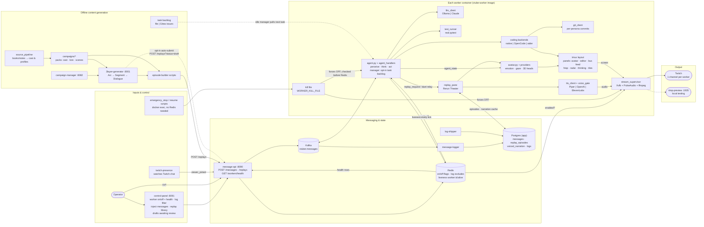
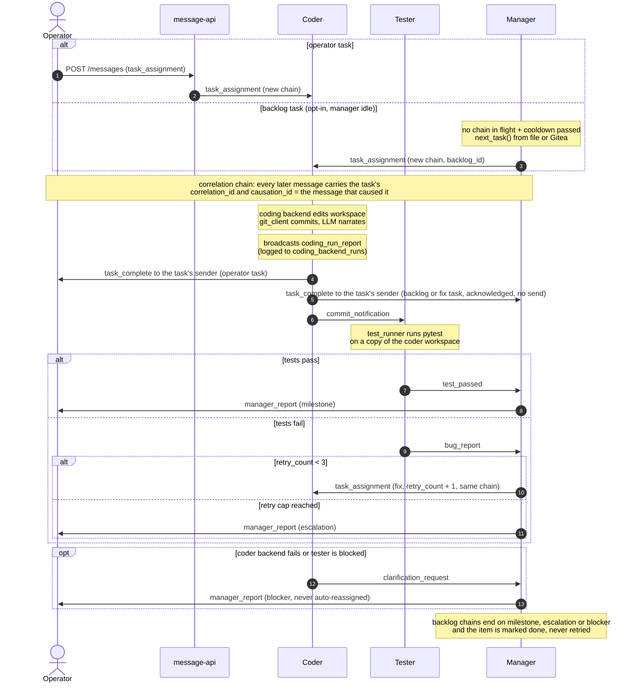
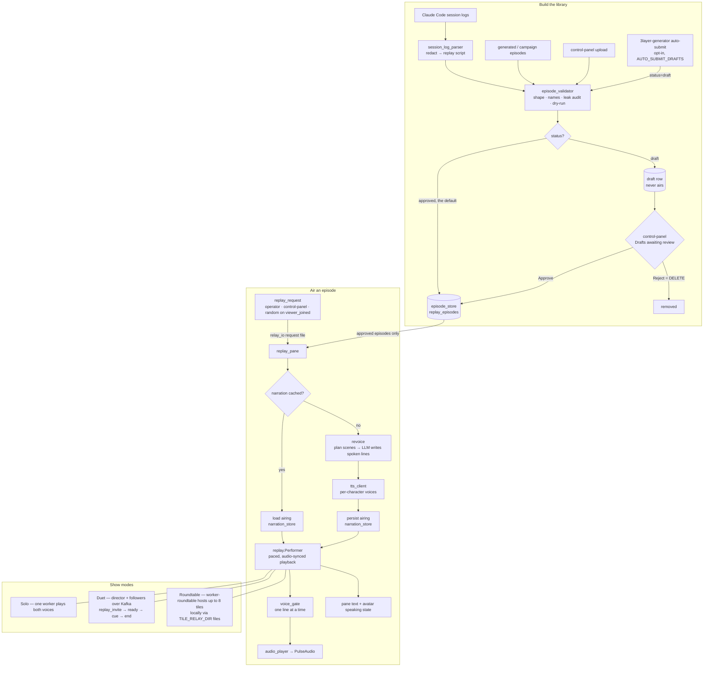
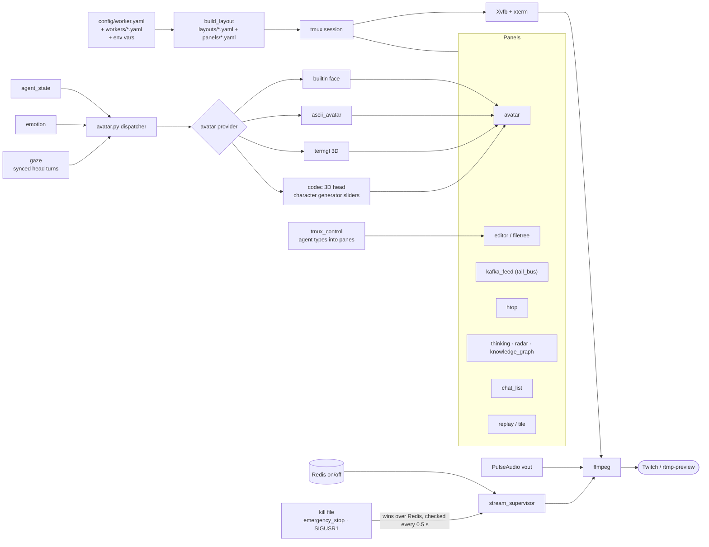
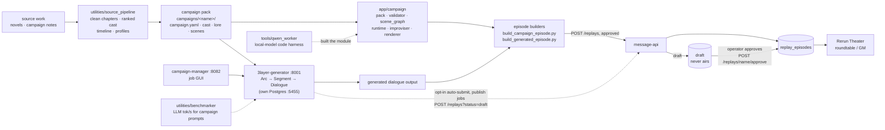

# virtualTubers — Feature & Component Flow

A feature-level map of the whole project: what each major component does and
how work, content, and media flow between them. It complements
[architecture_flow_diagram.md](architecture_flow_diagram.md), which zooms in on
infrastructure (who writes which database table, which service is the sole
Kafka producer). This file zooms in on **features**.

Render the Mermaid blocks with any Mermaid-capable viewer (GitHub, VS Code
preview, Obsidian, mermaid.live).

1. [System overview](#1-system-overview) — every major component on one page
2. [Dev-team task loop](#2-dev-team-task-loop) — coder → tester → manager (operator or backlog as the task source)
3. [Rerun Theater](#3-rerun-theater) — session logs → voiced shows (solo, duet, roundtable)
4. [On-screen rendering](#4-on-screen-rendering) — tmux layout, avatar, stream out
5. [Content generation](#5-content-generation) — source works → campaign packs → episodes

---

## 1. System overview

**How to read it**

- **Inputs & control** — the operator drives everything through
  `message-api` (curl) or the browser `control-panel`; `twitch-presence` turns
  arriving viewers into `viewer_joined` bus events.
- **Messaging & state** — one Kafka topic carries every inter-agent message;
  `message-logger` archives it to Postgres (with each message's
  `correlation_id` / `causation_id`). Redis holds only the per-worker on/off
  flag, log-filter excludes and the per-worker liveness key, which
  `GET /workers/health` and the control panel's health column read.
- **Kill switch** — `scripts/emergency_stop.sh` (or `.ps1` over SSH) drops a
  kill file into worker containers with `docker exec`; while it exists the
  agent pauses and ffmpeg stops without asking Redis, so it works when
  Redis/message-api are down. `emergency_resume` removes it.
- **Worker container** — every character (coder variants, manager, tester,
  GM `tuber_0`, roundtable) runs the same image; `config/workers/*.yaml` picks
  its role, LLM, coding backend, avatar, voice, and tmux layout.
- **Output** — each worker's virtual screen + audio is encoded by ffmpeg and
  pushed to its own Twitch channel (optionally tee'd to the local preview).
- **Offline content generation** — separate, on-demand stack. Nothing reaches
  the live stream until an episode builder `POST`s it to `/replays`. The
  generator's opt-in auto-submit only ever posts **drafts**, which cannot air
  until an operator approves them in the control panel.
- **Task backlog** — optional: an idle manager pulls its next task from a
  file or Gitea issues instead of waiting for the operator (off by default).

---

## 2. Dev-team task loop

The original show: an AI dev team solving real tasks on the seeded-bug
`sandbox/` workspace. Handlers live in `app/agent_handlers/` and are
dispatched from `MESSAGE_HANDLERS` by `app/agent.py`.

`task_complete` goes to whoever sent the task (the operator for an operator
task, the manager for a fix or backlog task). A narration-only coder whose
LLM fails also sends its `clarification_request` to the task's sender — a
known, low-priority quirk (docs/agent_flow_reference.md §3). Every agent
refreshes its Redis liveness key each tick, sends a `status_update` bus
heartbeat every `agent.bus_heartbeat_every` ticks (default 12), and writes
`agent_state` so its avatar shows thinking / speaking / listening / error.

---

## 3. Rerun Theater

Past real sessions (and generated campaign episodes) replay as paced,
redacted, voiced shows.

Details: [replay.md](replay.md), [replay_pane.md](replay_pane.md),
[revoice.md](revoice.md), [duet_replay.md](duet_replay.md),
[voice_gate.md](voice_gate.md), [episode_validator.md](episode_validator.md),
[episode_store.md](episode_store.md) (draft/approved), [draft_submitter.md](draft_submitter.md),
[relay_io.md](relay_io.md).

---

## 4. On-screen rendering

Details: [layout_system.md](layout_system.md), [panels.md](panels.md),
[avatar.md](avatar.md), [avatar_providers.md](avatar_providers.md),
[character_generator.md](character_generator.md), [gaze.md](gaze.md),
[stream_supervisor.md](stream_supervisor.md).

---

## 5. Content generation

The campaign layer turns the dev-team framework into a genre-hopping show
(D&D-style campaigns with a GM and cast). Generation is offline and GPU-heavy.

Details: [campaign_module_status.md](campaign_module_status.md),
[campaign_pack_format.md](campaign_pack_format.md),
[generator_retarget_flow.md](generator_retarget_flow.md),
[draft_submitter.md](draft_submitter.md).

Generated content never airs on its own: builder scripts and the manual
generator upload store an **approved** episode only when someone runs them,
and the generator's auto-submit (`AUTO_SUBMIT_DRAFTS`, off by default) only
creates **drafts**, which need an operator's Approve.
