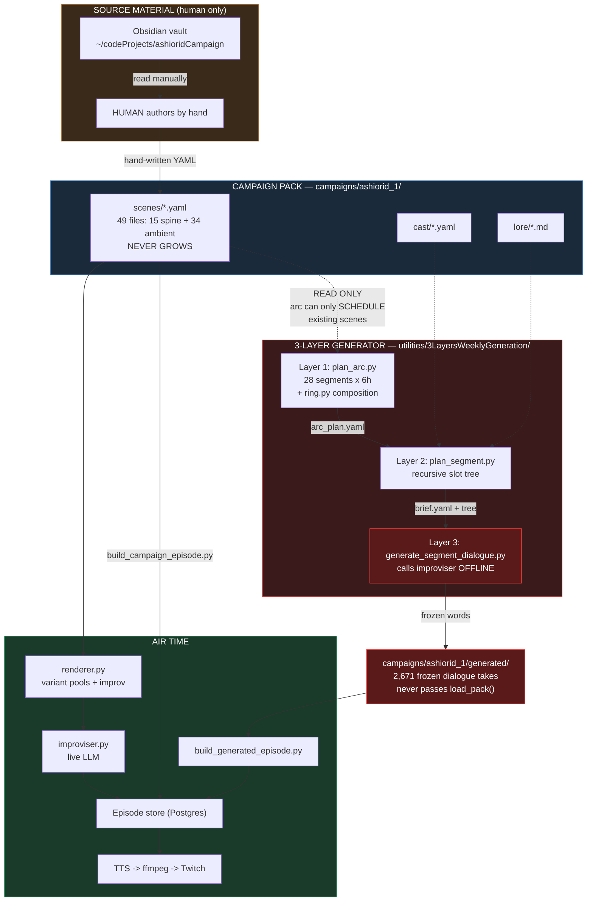
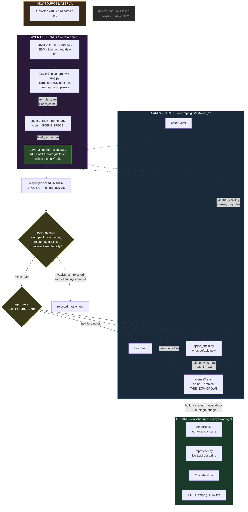
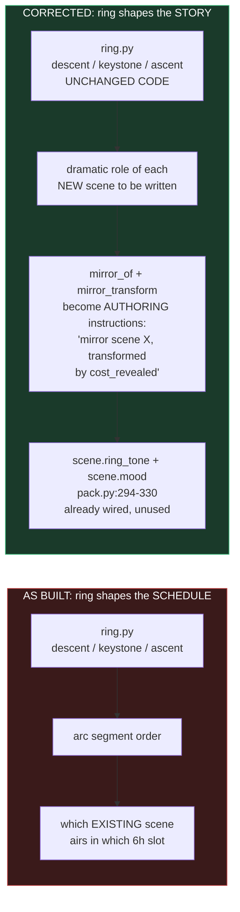

# 3-Layer Generator: As-Built vs. Corrected

Companion visual for `.claude/prompts/generator_retarget_scenes_plan.md`.

---

## Diagram 1 — What it does today (the mistake)

**The three problems this picture shows:**

1. **`scenes/` has no inbound arrow from the generator.** The only way the
   pack grows is the dotted human path on the left. The generator reads
   scenes and never writes them — `arc_schema.py:284` rejects any scene id
   not already in the pack.
2. **Layer 3 (red) duplicates the air-time path.** `generate_segment_dialogue.py`
   calls the same improviser that `renderer.py` calls, but offline, freezing
   words that were designed to vary on every airing.
3. **`generated/` bypasses `load_pack()`.** Two separate bridges into the
   episode store, and the generated one carries content no validator ever saw.

---

## Diagram 2 — The corrected pipeline

**What changed, in one line each:**

- **Layer 3 is now green, not red** — it writes scene source, not frozen words.
- **`scenes/` has an inbound arrow from the generator.** The pack grows. That
  was the entire point.
- **A gate sits between the model and tracked source.** Nothing reaches
  `scenes/` without passing the same `load_pack()` the hand-authored content
  passes, and nothing lands without an explicit `--promote`.
- **One bridge to air, not two.** After the change there is only one kind of
  content: authored pack scenes.
- **Dialogue moved back to air time**, where variant pools + `improv: true`
  make wording different on every airing — which is what
  `docs/campaign_content_expansion.md` specified all along.

---

## Diagram 3 — Ring composition, before and after

`ring.py` needs **no changes**. The ring spec is deliberately campaign-agnostic
*shape*, and shape belongs to composition rather than scheduling. `Scene` in
`app/campaign/pack.py:294-330` already carries `ring_tone` and `mood` fields
that nothing currently populates — they were built for exactly this direction
and are waiting.

---

## Reading it without a Mermaid renderer

**Today:** a human reads the Obsidian vault and hand-writes `scenes/*.yaml`.
The generator reads those scenes, plans a 168-hour arc over them, and then
Layer 3 calls an LLM to write frozen dialogue takes into a separate
`generated/` directory. Those takes bypass pack validation and reach the
stream through their own bridge. The scene library never grows.

**Corrected:** new source material enters at Layer 0. Layer 1 plans the arc
*and* declares which new scenes must exist to fill it. Layer 2 turns each
segment into slot-shaped scene specs. Layer 3' serializes those into real
scene YAML in a staging directory. A gate runs `load_pack()` over the pack
with the proposals overlaid, rejecting anything with a bad lore stem, unknown
cast id, or illegal primitive. Surviving scenes land in `scenes/` only on an
explicit `--promote`, with `spine_chain.py` wiring `default_next` so the new
scenes join the story graph. From then on they are ordinary pack content, and
dialogue is generated fresh at air time by the renderer and improviser — which
is where it belonged from the start.
