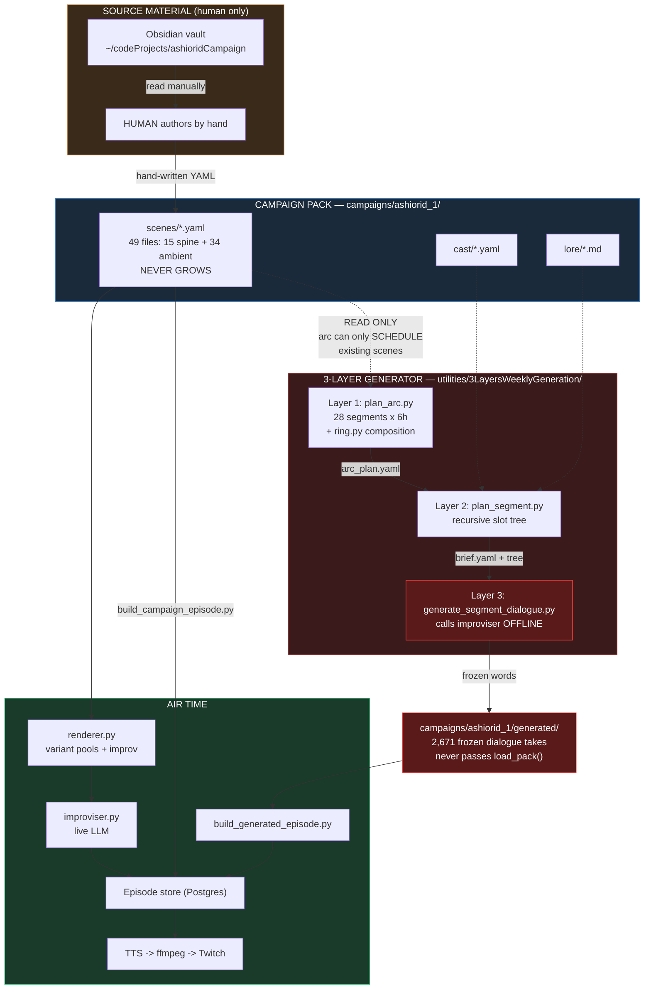
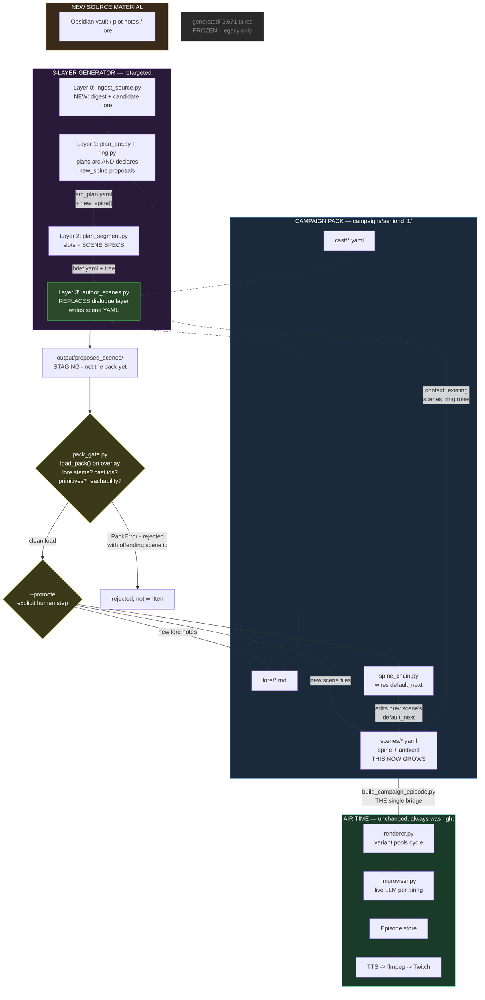
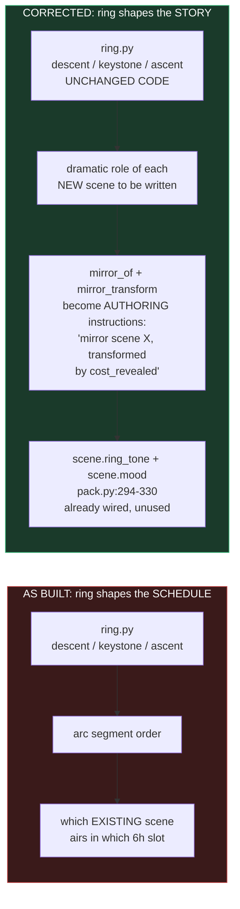
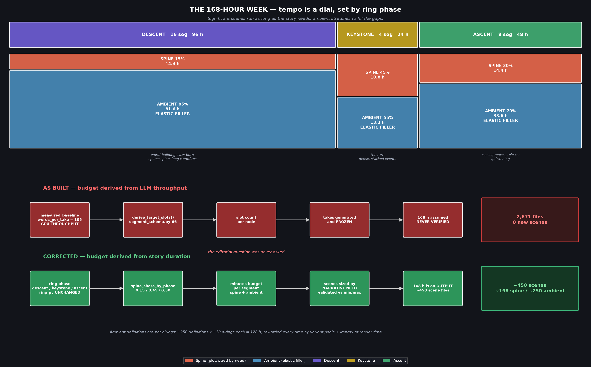
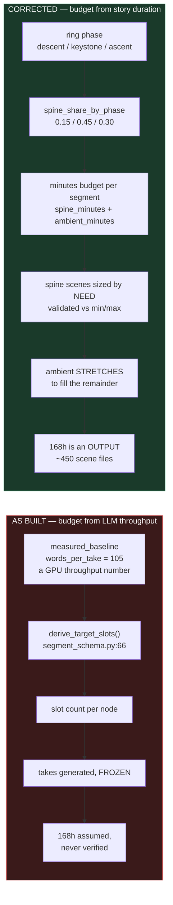
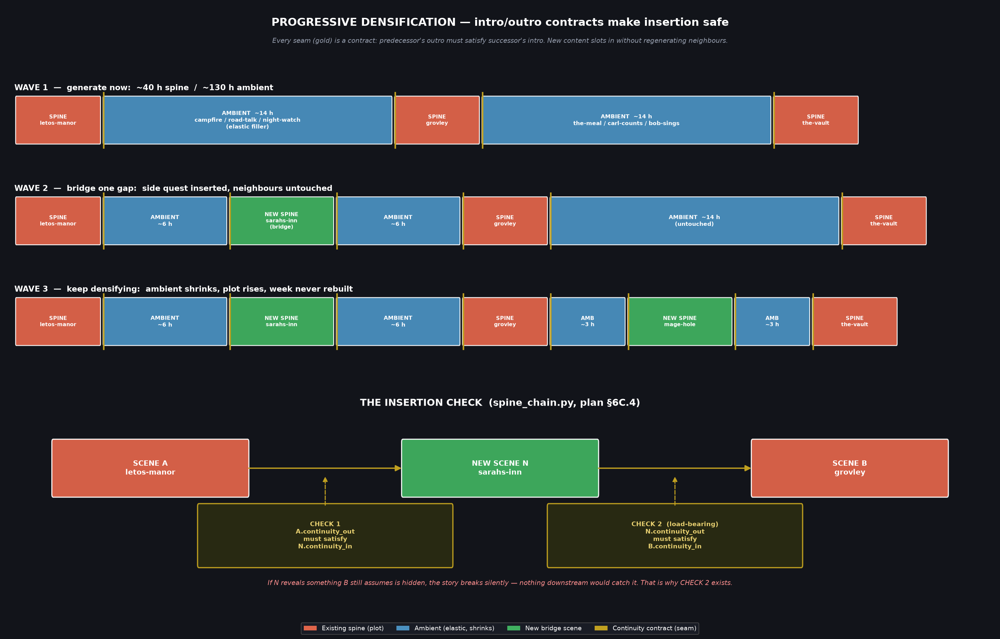
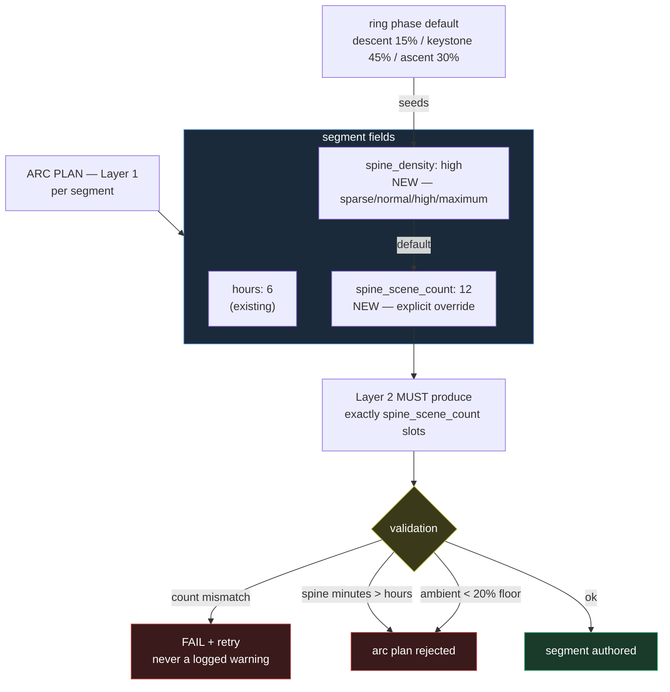

# 3-Layer Generator: As-Built vs. Corrected

Companion visual for `.claude/prompts/generator_retarget_scenes_plan.md`.

---

## Diagram 1 — What it does today (the mistake)

**The three problems this picture shows:**

1. **`scenes/` has no inbound arrow from the generator.** The only way the
   pack grows is the dotted human path on the left. The generator reads
   scenes and never writes them — `arc_schema.py:284` rejects any scene id
   not already in the pack.
2. **Layer 3 (red) duplicates the air-time path.** `generate_segment_dialogue.py`
   calls the same improviser that `renderer.py` calls, but offline, freezing
   words that were designed to vary on every airing.
3. **`generated/` bypasses `load_pack()`.** Two separate bridges into the
   episode store, and the generated one carries content no validator ever saw.

---

## Diagram 2 — The corrected pipeline

**What changed, in one line each:**

- **Layer 3 is now green, not red** — it writes scene source, not frozen words.
- **`scenes/` has an inbound arrow from the generator.** The pack grows. That
  was the entire point.
- **A gate sits between the model and tracked source.** Nothing reaches
  `scenes/` without passing the same `load_pack()` the hand-authored content
  passes, and nothing lands without an explicit `--promote`.
- **One bridge to air, not two.** After the change there is only one kind of
  content: authored pack scenes.
- **Dialogue moved back to air time**, where variant pools + `improv: true`
  make wording different on every airing — which is what
  `docs/campaign_content_expansion.md` specified all along.

---

## Diagram 3 — Ring composition, before and after

`ring.py` needs **no changes**. The ring spec is deliberately campaign-agnostic
*shape*, and shape belongs to composition rather than scheduling. `Scene` in
`app/campaign/pack.py:294-330` already carries `ring_tone` and `mood` fields
that nothing currently populates — they were built for exactly this direction
and are waiting.

---

## Diagram 4 — Pacing: tempo as a dial (plan §6A)

Regenerate with
`.venv/bin/python .claude/prompts/render_pacing_model_graph.py`.

**The inversion in one line:** the old chain asked *how many words does a model
emit per call*; the new chain asks *how long should this scene be*. Only the
second is an editorial question, and only the second can be paced.

**Why ambient elasticity matters more than it sounds.** Because ambient
stretches, spine density becomes a free variable — and tying it to ring phase
turns tempo into a dial. Descent breathes at 15% spine; the keystone stacks
events at 45%; ascent quickens at 30%. That is ring composition doing real
work on the *feel* of the week, not just reordering a playlist.

| Phase | Segs | Hours | Spine | Ambient |
|---|---|---|---|---|
| descent | 16 | 96 | 15% — 14.4 h | 81.6 h |
| keystone | 4 | 24 | 45% — 10.8 h | 13.2 h |
| ascent | 8 | 48 | 30% — 14.4 h | 33.6 h |
| **total** | **28** | **168** | **39.6 h** | **128.4 h** |

At 150 wpm that is 1,512,000 words — the 1.5M target arrived at from the story
side, not reverse-engineered from throughput.

**Ambient definitions are not airings.** ~250 definitions x ~10 airings each
covers 128 h, each airing differently worded by variant pools + `improv: true`.
Today's 34 definitions would mean 75 airings each — the same campfire premise
75 times, which no amount of rephrasing disguises.

---

## Diagram 5 — Progressive densification via continuity contracts (plan §6C)

Regenerate with
`.venv/bin/python .claude/prompts/render_densification_graph.py`.

Every scene carries `continuity_in` (state it assumes) and `continuity_out`
(state it guarantees). Two scenes chain when the first's outro satisfies the
second's intro — so chaining is a **contract**, not a hard edge, and new
content can be slotted between any two scenes later without regenerating
either neighbour.

**The build order this enables:**

| Wave | Spine | Ambient | Status |
|---|---|---|---|
| 1 — generate now | ~40 h | ~130 h | complete, airable, deliberately slow |
| 2 — bridge a gap | +1 scene | shrinks | one ambient stretch becomes plot |
| 3 — keep going | rising | shrinking | density grows, week never rebuilt |

**The seam already exists on one side only.** `arc_schema.py:226` and
`segment_schema.py:253` both already require `continuity_in`/`continuity_out` —
the *planner* reasons in continuity and then discards it, because
`app/campaign/pack.py:317` gives `Scene` only a spoken `enter_narration` and a
bare `default_next` edge. Adding the two fields to the pack format is what lets
that reasoning survive into the scene file, and it is what makes insertion
verifiable.

**Ambient scenes carry `continuity_in` only.** An ambient scene that emits a
`continuity_out` is a validation error — ambient decides nothing, so nothing may
ever depend on it having played. That rule is what keeps ambient injectable
anywhere, and it is the defect most likely to appear in generated ambient.

---

## Diagram 6 — Arc-level tempo control (plan §6D)

Scene count is directable **from the arc** — give the keystone 12 scenes and a
quiet descent segment 3. Crucially this is a *field*, not prompt wording: a
prompt-only instruction is unverifiable, so a keystone that quietly produced 3
scenes instead of 12 would look identical to one that worked. The count is
checked, and a mismatch retries rather than logging a warning nobody reads.

Two guards keep it honest: spine minutes must fit inside the segment's `hours`,
and every segment keeps a **20% ambient floor** so there is always elasticity
left to absorb a short scene. Zero ambient means any pacing drift becomes dead
air.

---

## Reading it without a Mermaid renderer

**Today:** a human reads the Obsidian vault and hand-writes `scenes/*.yaml`.
The generator reads those scenes, plans a 168-hour arc over them, and then
Layer 3 calls an LLM to write frozen dialogue takes into a separate
`generated/` directory. Those takes bypass pack validation and reach the
stream through their own bridge. The scene library never grows.

**Corrected:** new source material enters at Layer 0. Layer 1 plans the arc
*and* declares which new scenes must exist to fill it. Layer 2 turns each
segment into slot-shaped scene specs. Layer 3' serializes those into real
scene YAML in a staging directory. A gate runs `load_pack()` over the pack
with the proposals overlaid, rejecting anything with a bad lore stem, unknown
cast id, or illegal primitive. Surviving scenes land in `scenes/` only on an
explicit `--promote`, with `spine_chain.py` wiring `default_next` so the new
scenes join the story graph. From then on they are ordinary pack content, and
dialogue is generated fresh at air time by the renderer and improviser — which
is where it belonged from the start.
