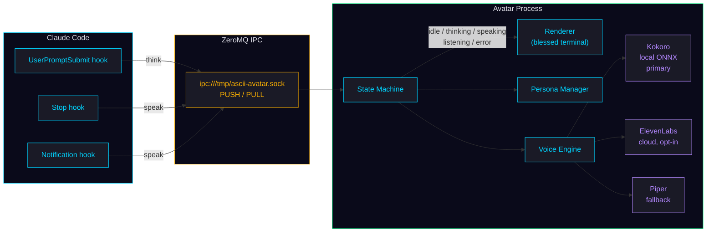

<p align="center">
  
</p>

```
  █████╗ ███████╗ ██████╗██╗██╗      █████╗ ██╗   ██╗ █████╗ ████████╗ █████╗ ██████╗
 ██╔══██╗██╔════╝██╔════╝██║██║     ██╔══██╗██║   ██║██╔══██╗╚══██╔══╝██╔══██╗██╔══██╗
 ███████║███████╗██║     ██║██║     ███████║██║   ██║███████║   ██║   ███████║██████╔╝
 ██╔══██║╚════██║██║     ██║██║     ██╔══██║╚██╗ ██╔╝██╔══██║   ██║   ██╔══██║██╔══██╗
 ██║  ██║███████║╚██████╗██║██║     ██║  ██║ ╚████╔╝ ██║  ██║   ██║   ██║  ██║██║  ██║
 ╚═╝  ╚═╝╚══════╝ ╚═════╝╚═╝╚═╝     ╚═╝  ╚═╝  ╚═══╝  ╚═╝  ╚═╝   ╚═╝   ╚═╝  ╚═╝╚═╝  ╚═╝
```


A cyberpunk ASCII avatar that lives in a tmux pane alongside Claude Code. It watches Claude think, speak, and listen — animating in real time and reading responses aloud via local TTS.

---

## How it works



Claude Code pushes events over a Unix socket (ZeroMQ PUSH/PULL). The avatar pulls those events, drives a thread-safe state machine, animates the terminal renderer, and synthesizes speech. When models are absent or `--no-voice` is passed, it falls back to animation-only mode.

---

## Features

- Five animation states — idle, thinking, speaking, listening, error — each with distinct frame sets and timing
- Local TTS via [Kokoro ONNX](https://github.com/thewh1teagle/kokoro-onnx) (~338 MB, no API key required)
- Three personas with distinct voice, color, and animation speed
- ZeroMQ IPC — hooks fire on every Claude tool use with no perceptible latency
- MCP server so Claude can control its own avatar directly via tool calls
- `avatar-bridge` CLI for scripting and manual testing
- Portrait mode: swap ASCII frames for an image rendered in the terminal
- Headless mode for CI and integration testing

---

## Personas

| Persona | Color | Voice | Engine | Personality | Speed |
|---------|-------|-------|--------|-------------|-------|
| `ghost` (default) | cyan | af_bella | Kokoro | minimal | 1.0x |
| `oracle` | amber | bf_emma | Kokoro | sage | 0.8x |
| `spectre` | green | — | ElevenLabs | glitch | 1.3x |

`spectre` requires `ELEVENLABS_API_KEY`. Without it, it falls back to Kokoro if models are present, otherwise animation-only.

---

## Quick start

**One command** installs the package, downloads TTS models, configures Claude Code hooks, and sets up the tmux launcher:

```bash
# Install portaudio first (required for TTS audio)
sudo apt install portaudio19-dev   # Debian/Ubuntu
sudo dnf install portaudio-devel   # Fedora/RHEL

# Then install everything
curl -sSL https://raw.githubusercontent.com/Angelopvtac/ascii-avatar/master/install.sh | bash
```

That's it. Start using it:

```bash
avatar-session       # tmux: Claude Code + avatar side-by-side
avatar               # standalone avatar process
```

<details>
<summary>Manual install (step-by-step)</summary>

```bash
pipx install "git+https://github.com/Angelopvtac/ascii-avatar.git[kokoro]"
bash scripts/install.sh          # download TTS models
bash scripts/setup-hooks.sh      # print Claude Code hook config
bash scripts/setup-tmux.sh       # add tmux alias
```
</details>

<details>
<summary>Install options</summary>

```bash
# Skip TTS (animation only, no voice)
curl -sSL .../install.sh | bash -s -- --no-tts

# Skip Claude Code hooks setup
curl -sSL .../install.sh | bash -s -- --no-hooks

# Uninstall everything
curl -sSL .../install.sh | bash -s -- --uninstall
```
</details>

Press `q` or `Esc` to quit.

---

## Claude Code integration

### Hooks (automatic)

Hooks fire on every tool use, keeping the avatar in sync with Claude's activity. Add to `~/.claude/settings.json`:

```json
{
  "hooks": {
    "PreToolUse": [
      { "command": "avatar-bridge think" }
    ],
    "PostToolUse": [
      { "command": "avatar-bridge idle" }
    ],
    "Notification": [
      { "command": "avatar-bridge speak \"$CLAUDE_NOTIFICATION\"" }
    ]
  }
}
```

Run `bash scripts/setup-hooks.sh` to print this config with paths filled in.

### MCP server (tool-based control)

The MCP server lets Claude control its own avatar via tool calls. Add to `~/.claude/settings.json`:

```json
{
  "mcpServers": {
    "ascii-avatar": {
      "command": "avatar-mcp"
    }
  }
}
```

Available tools: `avatar_think`, `avatar_speak`, `avatar_listen`, `avatar_idle`.

---

## tmux setup

To launch Claude Code and the avatar side-by-side automatically:

```bash
bash scripts/setup-tmux.sh
source ~/.bashrc
clauded-avatar
```

This creates a tmux session with the avatar in a 45-column split pane.

---

## CLI reference

**Avatar process**

```
avatar [--persona ghost|oracle|spectre] [--socket PATH] [--no-voice]
       [--no-color] [--voice VOICE_ID] [--audio-device INDEX]
       [--compact] [--no-boot] [--portrait PATH] [--headless] [-v]
```

**Bridge (send events to a running avatar)**

```
avatar-bridge [--socket PATH] think|listen|idle
avatar-bridge [--socket PATH] speak TEXT
avatar-bridge [--socket PATH] error [MESSAGE]
```

---

## Troubleshooting

**"Kokoro model not found"** — run `bash scripts/install.sh`. The avatar continues in animation-only mode until models are present.

**No audio / `sounddevice` error** — install `portaudio` system library before Python deps (see Quick start step 1).

**Socket errors** — ensure the avatar process is running before sending events. The `--socket` path must match on both sides (default: `/tmp/ascii-avatar.sock`).

**ElevenLabs not working** — set `ELEVENLABS_API_KEY` in your environment before starting the avatar.

---

## License

MIT
